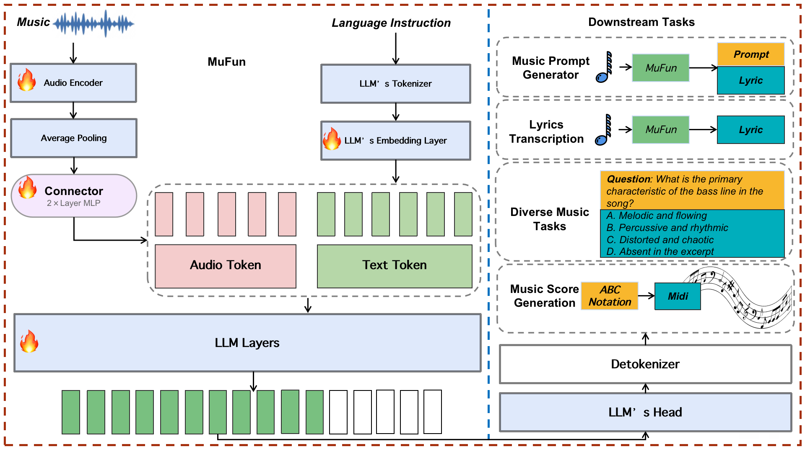

<h1 align="center">MuFun</h1>

<div align="center">
    <a href="https://arxiv.org/abs/2508.01178"></a>
    <a href="https://huggingface.co/collections/Yi3852/mufun-68943d4ad905f4e23e35b86d"></a>
</div>

<p align="center">
          🤗 <a href="https://huggingface.co/collections/Yi3852/mufun-68943d4ad905f4e23e35b86d">Models</a>&nbsp&nbsp | &nbsp&nbsp🤗 <a href="https://huggingface.co/datasets/Yi3852/MuCUE">Eval Data</a>&nbsp&nbsp | &nbsp&nbsp 📑 <a href="https://arxiv.org/abs/2508.01178">Paper</a> &nbsp&nbsp | &nbsp&nbsp💜 <a href="https://rickey-cs.github.io/MuCUE-Bench/"><b>BenchMark</b></a>&nbsp&nbsp
<br>

<p align="center">
    
<p>

training and fine-tuning code for the MuFun model proposed in [Advancing the Foundation Model for Music Understanding](https://arxiv.org/abs/2508.01178)

Our main training code is adapted from [TinyLLaVA Factory](https://github.com/TinyLLaVA/TinyLLaVA_Factory) to support audio input, as for reinforcement learning we modify the HuggingFace TRL library.

## Contents

- [Inference Code](#inference-code)
- [Installation](#installation)
- [Data Preparation](#data-preparation)
- [Finetuning](#finetuning)
- [Train from Scratch](#train-from-scratch)
- [Reinforcement Learning](#reinforcement-learning)
- [Custom Model Architecture](#custom-model-architecture)
- [Citation](#citation)

## Inference Code

for inference it's not necessary to install this repo, only some audio processing packages like mutagen, torchaudio are needed

```python
from transformers import AutoTokenizer, AutoModelForCausalLM
hf_path = 'Yi3852/MuFun-Instruct' # or 'Yi3852/MuFun-Base'
tokenizer = AutoTokenizer.from_pretrained(hf_path, use_fast=False)
device='cuda'
model = AutoModelForCausalLM.from_pretrained(hf_path, trust_remote_code=True, torch_dtype="bfloat16")
model.to(device)

# single audio
# during inference the audio(converted to a sequence of embeddings) will be placed in the position of <audio> tag in the prompt
aud="/path/to/your/song.mp3"
inp="\n<audio>Can you listen to this song and tell me its lyrics?" 
res=model.chat(prompt=inp, audio_files=aud, tokenizer=tokenizer)
print(res)

# multiple audios
# for multiple songs each will be placed in the coresponding <audio> tag in the prompt
aud=["/path/to/your/song1.mp3", '/path/to/your/song2.mp3']
inp="\n<audio> This is song1. <audio> This is song2. Which song do you like more? Tell me the reason."
res=model.chat(prompt=inp, audio_files=aud, tokenizer=tokenizer)
print(res)

# analyze only a specific segment of audio using the segs parameter
# format is [start_time, end_time](in seconds), for multiple audios segs can be passed like [[0,30],[60,90]], [None,[0,30.0]]
aud="/path/to/your/song.mp3"
inp="\n<audio>How is the rhythm of this music clip?"
res=model.chat(prompt=inp, audio_files=aud, segs=[0,30.0], tokenizer=tokenizer)
print(res)

# set audio_files=None will work, however it is not recommended to use it as a text model
```

## Installation

```bash
git clone https://github.com/laitselec/MuFun.git
cd MuFun

conda create -n mufun python=3.10 -y
conda activate mufun
pip install --upgrade pip

pip install -e .
pip install flash-attn==2.7.4.post1 --no-build-isolation # optional, otherwise change --attn_implementation to sdpa in train scripts
```

## Data Preparation

see `data_preparation_example.ipynb`
dataset is in stored a json file, and the format for each sample is like this:

```json
{
    "id": "LCeUo2tfY4LFpc5r3jiZid",
    "audio": "~/gtzan/genres/blues/blues.00000.wav",
    "conversations": [
        {
            "from": "human",
            "value": "<audio>\nWhat category of music does this track fall under? (choose the genre from: blues, classical, country, disco, hiphop, jazz, metal, pop, reggae, and rock.)"
        },
        {
            "from": "gpt",
            "value": "blues"
        }
    ]
},
```

## Finetuning

after modifying paramters like data path in `scripts/finetune.sh`, run:

```bash
sh scripts/finetune.sh
```

## Train from Scratch

modify paramters in `scripts/train_scratch.sh`, `scripts/warmup_qwen.sh` and `scripts/trainfull_qwen.sh`

```bash
# this will strat the warmup training where --tune_type_llm and tune_type_vision_tower are set to frozen 
sh scripts/train_scratch.sh

# after above is done, modify pretrained_model_path(checkpoint-xxx) in trainfull_qwen.sh to what you get
# then in train_scratch.sh comment the bash scripts/warmup_qwen.sh line and uncomment the bash scripts/trainfull_qwen.sh line
# this will start full training where parameters of all modules are tuned
sh scripts/train_scratch.sh
```

## Reinforcement Learning

currently we support GRPO, for more details see `tinyllava/train/train_grpo.py` and `trl-main/trl/trainer/grpo_trainer.py`

```bash
# install our modified trl library first
cd trl-main/
conda install -c conda-forge pyarrow
pip install .
cd ..

sh scripts/grpo.sh
```

## Custom Model Architecture

our framework is suitable for training general llava-kind audio language models, if you want to use other type of llm, audio tower or connector, go to `tinyllava/model`, `tinyllava/data/template` and add or modify the code accordingly

## Citation

```bibtex
@misc{jiang2025advancingfoundationmodelmusic,
      title={Advancing the Foundation Model for Music Understanding}, 
      author={Yi Jiang and Wei Wang and Xianwen Guo and Huiyun Liu and Hanrui Wang and Youri Xu and Haoqi Gu and Zhongqian Xie and Chuanjiang Luo},
      year={2025},
      eprint={2508.01178},
      archivePrefix={arXiv},
      primaryClass={cs.SD},
      url={https://arxiv.org/abs/2508.01178}, 
}
